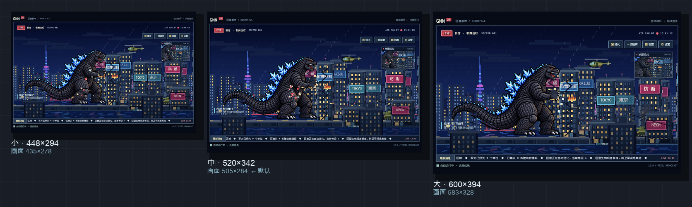
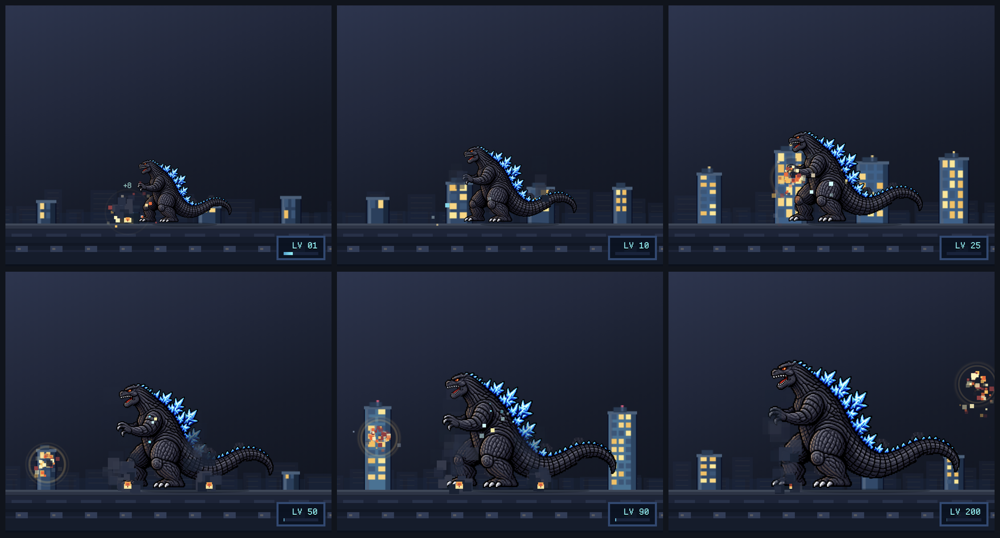
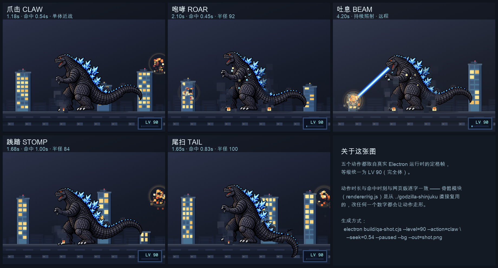

# 巨兽都市桌宠 · godzilla-pet

一个常驻桌面的哥斯拉。它自己拆楼、自己进化，从只能拍碎平房的幼体慢慢长成
能一脚踩平高楼的完全体。全程不需要你操作。

两种画面，同一个托盘：

| 画面 | 是什么 |
| --- | --- |
| **迷你电视**（默认） | 把网页版原封不动装进一个小窗，像桌上摆了台小电视，一直在播哥斯拉拆新宿。**画面一个像素都没重画。** |
| **底座模式** | 透明悬浮窗，只有哥斯拉和它脚下那截城市断面是实心的，底下的桌面照常能看见、能点。 |

托盘菜单里的「画面」随时切换，两种模式各自记住自己的尺寸和位置。

```bash
npm install                  # 装依赖（Electron 运行时）
npm start                    # 前台跑一个，调试用
sh build/make-app.sh         # 装成可双击的应用 → ~/Applications/巨兽都市桌宠.app
```

`npm start` 是从终端直接跑，**终端一关它就没了**，只适合调试。
日常用请走 `make-app.sh` 装成真正的应用：双击即开，不占 Dock、不在 Cmd-Tab 里，
退出走托盘菜单或 `⌘Q`。

> **不能直接把项目目录当应用使。** Electron 必须把项目目录作为启动参数才能
> 加载我们的主进程，而通过 LaunchServices 启动时（双击 / open / 登录项）
> macOS 会自己往参数里塞东西，路径根本到不了 Electron，它就退回自带的欢迎页
> ——不报错，只是"双击打开的是一页英文说明"。所以 `.app` 里包了一层启动器
> 自己拼 argv，安装位置也必须是 `~/Applications` 而不是项目目录。
> 两个原因都写在下面的坑三里。

---

## 迷你电视（默认）

窗口里播的就是 `../godzilla-shinjuku` 那份网页版：像素新宿夜景、GNN 直播包装、
滚动新闻条、地面机位小窗，连它自带的进化系统、离线收益、自动战斗全都照旧。
**godzilla-pet 不复制也不改写原版文件**，直接用 `loadFile` 把那个页面打开。



> 三档 1:1 实尺寸，默认中档 520×342，屏幕上的画面 505×284。

做法是给窗口一个「桌面宽度」的**布局视口**，再用缩放系数把整页等比缩小：

```
窗口内的布局视口恒为 1120 × 736
缩小系数 = 窗口宽 / 1120
窗口尺寸 = 1120 × 736 × 系数
```

**为什么不直接把窗口缩到 500px 宽？** 因为原版有一堆固定像素（页眉 46px、
页脚 38px、正文字号 12px），窗口真缩到那个宽度会撞上它自己的
`@media(max-width:680px)`，版面会切成另一套——画面铺满视口、页脚消失。
保持桌面宽度的视口再整体缩放，比例才和原版逐像素一致。

视口必须同时满足两条：宽度 > 1050px（绕开 1050 / 680 两个窄屏断点）、
高度装得下页眉 + 画面 + 页脚（≥704px，否则出滚动条）。在这两条之内，
视口越贴近画面的实际尺寸，四周留白越少——1120×736 是实测留白最少、
上下左右又均匀的一档。用 1280×720 的话 `.shell` 只有 1104 宽，左右会各空出
88px 黑边。

`tests/tv.test.cjs` 把这些不变式钉住了：只改档位宽度、忘了跟着算高度，
测试会直接报出来——那正是最容易犯、后果最隐蔽的错。

拖动靠注入一条 `-webkit-app-region` 规则：四周深色留白和上下两条状态栏可拖，
画面本体保持可交互。**注入内容里没有任何视觉属性**，这条也有测试守着
（`tv-config.js` 里出现 `color` / `font` / `margin` 之类就直接失败）。

迷你电视的存档就是原版游戏自己的那份（localStorage 键 `gnn-kaiju-idle-v3`，
每 5 秒写一次），所以关掉再打开，等级和离线收益都接着算。

## 底座模式

这一档是重画的场景：渲染层自己排布城市断面、建筑塌缩和特效，
底下的桌面照常能看见、能点。

### 它自己会做什么

| 行为 | 触发 | 说明 |
| --- | --- | --- |
| 拆楼 | 恒定节奏 | 走到最近的建筑前，按当前解锁的最强技能结算，建筑逐段塌 |
| 挂机收益 | 每秒 | 基础 1.6 经验/秒，每级 +0.1 |
| 离线收益 | 启动时 | 最长结算 8 小时，效率 55%，超过 1 分钟才提示 |
| 驻足休息 | 随机 | 偶尔原地站 1.6–4.2 秒，比一直走动更像活物 |
| 来回踱步 | 城市重建的空档 | 没有可拆的楼时在底座上来回走，等城市刷新 |

### 你能做什么

| 操作 | 效果 |
| --- | --- |
| 拖动身体 | 挪窗口位置，松手即记住，下次还在那 |
| 左键点它 | 摸头，+6 经验，4 秒冷却 |
| 悬停 | 展开成长卡片：阶段、经验、拆除数、陪伴时长 |
| 右键 | 暂停 / 静音 / 窗口大小 / 置顶 / 穿透 / 回位 / 退出 |
| 托盘图标 | 同样的开关，外加"收起" |

「穿透点击」打开后整个窗口对它下面的一切都不再挡路，纯粹观赏。默认关闭时
也会**自动穿透**：光标压在透明像素上会直接点到桌面，只有真正压在哥斯拉或
建筑上才由它接管——所以它摆哪儿都不会挡住你干活。

### 成长系统

等级、经验、阶段、体型四者由同一套公式推导，**存档只存等级和经验**，其余
全部是派生值，因此不存在"存档写坏导致体型和等级对不上"的情况。

| 阶段 | 等级 | 解锁技能 | 城市 | 身高 |
| --- | --- | --- | --- | --- |
| 幼体 HATCHLING | 1 | 爪击 | 平房 | 62px |
| 少年 JUVENILE | 10 | 咆哮 | 小楼 | 75px |
| 青年 ADOLESCENT | 25 | 原子吐息 | 大楼 | 90px |
| 成熟 MATURE | 50 | 践踏 | 大楼 | 103px |
| 完全体 APEX | 90 | 尾扫 | 高楼 | 114px |

身高走的是饱和曲线而不是分段台阶——每一级都在涨、涨幅逐级收窄，渐近于
140px 而**永不触及**。上限 140 不是随手取的：角色连尾巴的长宽比约 2.03:1，
窗口宽高比 5:4，140px 是"两侧还留得下走动余地、尾巴末端允许略带出画"的
临界值。换句话说，挂多久都不会撑破窗口。



> 同一套窗口尺寸下的六个等级，均为静止姿态、同一站位。城市高度随阶段一起长，
> 所以"长大"是宠物与楼群同时可见的变化。

数值公式：

```
身高   = 62 + 78 × (1 - 1 / (1 + (lv-1)/44))
升级需 = round(26 × lv^1.36)
拆楼   = 档次基础 {8, 20, 45, 90} × (1 + (lv-1)×0.03)
摸头   = 6 经验，4 秒冷却
离线   = seconds × 0.55 × 当前产速，seconds 上限 28800
```

## 目录

```
main.js                Electron 主进程：两套窗口、托盘、IPC、状态持久化
tv-config.js           迷你电视的档位与注入内容（主进程与开发工具共用同一份）
preload.js             contextBridge，只暴露必要的几个方法
renderer/              底座模式的渲染层
  index.html           画布 + 角标 + 悬停卡片 + 横幅
  pet.css              三档尺寸共用一套布局（--s 缩放变量）
  growth.js            成长系统，纯逻辑，可被 node 直接 require
  rig.js               骨骼动画，派生自 ../godzilla-shinjuku/rig.js
  part-bounds.js       各部件不透明边界（离线用 PIL 预计算）
  pet.js               渲染层主体：行为决策、建筑、特效、接触几何
assets/
  parts/               12 个骨骼部件的 PNG
  fonts/               方正像素字体（含 OFL 许可证）
  trayTemplate*.png    菜单栏图标，纯黑 + alpha，自动反色
build/
  make-icons.py        托盘 / 应用图标生成器，带 --preview 终端预览
  make-part-bounds.py  量部件不透明边界，生成 renderer/part-bounds.js
  make-app.sh          生成并安装可双击的 .app（默认 ~/Applications）
  qa-shot.cjs          底座模式截图工具，在真实 Electron 里抓图
  tv-shot.cjs          迷你电视截图工具，并回读版面与 app-region 实测值
  cdp-probe.cjs        用远程调试端口查运行中的窗口到底加载了什么
tests/
  growth.test.cjs      成长系统自检，33 项
  rig.test.cjs         骨骼与坐标系契约，11 项
  tv.test.cjs          迷你电视档位与注入契约，7 项
  app-bundle.test.cjs  应用包与启动器契约，8 项
```

## 开发

```bash
npm test                       # 自检，59 项，零依赖（node:test）
sh build/make-app.sh           # 生成并安装 .app（改过 main.js 要重装才生效）
npm run icons                  # 重新生成托盘图标
npm run bounds                 # 重新量部件边界（换了部件图之后必须跑）
python3 build/make-icons.py --preview       # 顺便在终端把图标打成 ASCII 核对
python3 build/make-part-bounds.py --check   # 只校验边界表是否过期
```

四个测试文件各有分工：`tests/growth.test.cjs` 管成长公式（体型曲线单调性、
阶段阈值、经验守恒、存档钳制），`tests/rig.test.cjs` 管骨骼与坐标系的契约
（部件表与边界表必须对齐、漏传 `ground` 会算出 NaN、脚底必须落在地面上、
嘴部挂点必须经变换后才落进画面），`tests/tv.test.cjs` 管迷你电视的档位不变式
（视口必须越过窄屏断点、高度必须装得下内容、高度必须等于视口高 × 系数、
注入内容里不能出现视觉属性），`tests/app-bundle.test.cjs` 管"怎么把应用启动
起来"（启动器必须把项目目录传给 Electron、`PROJ` 必须是写死的绝对路径、
装着的位置错了必须警告）。这四类坑都真踩过，见下。

`app-bundle.test.cjs` 会真的跑一遍 `make-app.sh` 装到临时目录再检查产物，
所以它验证的是生成出来的东西，不是源码里有没有某句话。装到临时目录而不是
项目目录，也顺便保证了它不会顺手杀掉你正在看的那个桌宠。

截图工具跑的都是真实 Electron 运行时：

```bash
# 迷你电视：按档位抓图，顺便回读版面实测值与 app-region
env -u ELECTRON_RUN_AS_NODE ./node_modules/.bin/electron build/tv-shot.cjs \
  --size=medium --tv --out=/tmp/tv.png

# 底座模式：注入等级、定格某个动作的关键帧
env -u ELECTRON_RUN_AS_NODE ./node_modules/.bin/electron build/qa-shot.cjs \
  --level=25 --out=/tmp/shot.png
```

参数一律用 `--键=值` 的形式（脚本按 `--level=` 前缀匹配，空格分隔取不到值）。
`tv-shot.cjs` 支持 `--size=small|medium|large`、`--tv` 注入拖动区域并回读
`app-region`、`--w`/`--h`/`--zoom` 手动指定、`--wait` 抓图前等待毫秒数、
`--pad` 给窗口留白上色（默认洋红，一眼看出画面占了多少）。
`qa-shot.cjs` 支持 `--level` 注入等级、`--w`/`--h` 窗口尺寸、`--wait`、
`--action=claw|roar|beam|stomp|tail` 配 `--seek` 定格某个动作的某一秒、
`--slot` 指定目标建筑位、`--bg` 铺一层模拟桌面底色、`--paused` 冻结世界。

想核对**已经装好、正在运行**的那个窗口里究竟加载了什么，用 `cdp-probe.cjs`。
应用是 GUI 程序、没有终端，所以调试端口靠环境变量递进去：

```bash
launchctl setenv GNN_DEBUG_PORT 9222
open -a "$HOME/Applications/巨兽都市桌宠.app"
node build/cdp-probe.cjs 9222      # 打印页面 URL、视口、缩放、拖动区域
launchctl unsetenv GNN_DEBUG_PORT
```

不设这个变量时端口完全不开，正常使用不受影响。桌面上的窗口没法截图
（需要系统的"屏幕录制"权限），这个探针是唯一能直接问"屏幕上那个窗口到底在播
什么"的办法——坑三里"打开的是欢迎页"就是靠它坐实的。

> 注意：如果环境里带着 `ELECTRON_RUN_AS_NODE=1`，Electron 会退化成纯 Node，
> 拿不到 `ipcMain` 之类的 GUI 模块。所有 Electron 调用前都要 `env -u` 清掉它。

## 踩过的三个坑

这三个的共同点是**都不报错**。前两个看起来像"美术没做好"，第三个看起来像
"双击没反应"——全都得靠诊断数据才抓得出来。

### 一、角色浮在半空

`rig.js` 的骨架求解第一行是 `root.y = ground - (1024-枢轴)*SCALE`，而 `pet`
对象漏了 `ground` 字段，于是整条正向运动学一路算出 `NaN`。canvas 的
`translate(NaN, NaN)` 是**静默空操作**（规范要求非有限参数直接返回、不改变换），
所以既不报错也不崩，只是把所有部件按各自的枢轴坐标草草摆了一遍——而那套坐标
恰好长得像只怪兽，于是看起来就像"一个站姿有点怪的哥斯拉悬在半空"，
越长大浮得越高。修法就一行：给 `pet` 补上 `ground: GROUND`。

### 二、光束从屏幕外射进来

`rigState.muzzle` 解出来的是**骨骼空间**坐标（约 328,-76），而光束是按设计
坐标（320×256）画的。两者混用，光束起点就跑到画面右上角之外了。之前 `muzzle`
是 NaN 时这条线根本画不出来，所以第一个坑修好之前它一直被掩盖着。修法是加了
`rigToDesign()` / `designToRig()` 两个换算，所有从骨骼里取出来的挂点都必须过一遍。

这两个坑现在都由 `tests/rig.test.cjs` 钉住了。

### 三、双击打开的是欢迎页，或者干脆什么都不发生

这条最花时间，因为它有**两个毫不相干的成因**，表现还都很安静。

**（1）启动参数到不了 Electron。** 从终端直接跑
`electron <项目目录>` 是正常的；但换成 `open`、双击或登录项，argv 就不再由
我们掌控：

```
open -a Electron.app --args <项目目录>   → 只出欢迎页，main.js 根本不执行
launchctl submit -- Electron <项目目录>  → 被沙箱拒绝，不可用
```

两个都是实测结论。所以 `.app` 的 `CFBundleExecutable` 是一个我们自己写的
启动器，由它来拼 argv：

```sh
exec "$ELECTRON" "$PROJ"     # 这一行就是整个包装存在的理由
```

漏掉 `"$PROJ"` 就会退回欢迎页，而且没有任何报错。

**（2）装在 `~/Documents` 里会卡死在启动早期。** 同一个 `.app`：

| 位置 | 结果 |
| --- | --- |
| `~/Documents/.../godzilla-pet/dist/` | 主进程活着，但**不起任何渲染/GPU 子进程**，窗口不出现，也从不写存档；零报错、零日志，`lsof` 能看到它已加载 Electron Framework，就是走不下去 |
| `~/Applications/` | 一切正常 |

原因是 macOS 的「文稿」隐私保护：位于受保护目录内的 app 包，读取自身资源
会被拦，而 Chromium 要 fork 渲染/GPU 子进程，于是卡死在启动早期。所以安装
目标是 `~/Applications`——桌面应用本来就该待的地方，而不是项目内。
`make-app.sh` 在你把目标设成项目目录时会明确警告。

`tests/app-bundle.test.cjs` 把这个包的契约钉住了：启动器必须把项目目录作为
第一个参数交给 Electron、`PROJ` 必须是写死的绝对路径且真的指向本项目、
`LSUIElement` 必须为真、装到坏位置时必须有警告。

## 和网页版的关系

迷你电视直接**播放**网页版，不做任何转换。底座模式则复用它的骨骼动画
（`renderer/rig.js`、`assets/parts/`），为的是让两边的**动作时长完全一致**：

| 动作 | 时长 | 命中时刻 |
| --- | --- | --- |
| 爪击 claw | 1.18s | 0.54s |
| 咆哮 roar | 2.10s | 0.45s |
| 吐息 beam | 4.20s | — |
| 践踏 stomp | 1.68s | 1.00s |
| 尾扫 tail | 1.65s | 0.83s |



底座模式与网页版的差异只在于：换了坐标系（渲染层固定 320×256 设计坐标，
靠 `--s` 变量缩放到实际窗口），并且用预先算好的部件边界做接触判定，
而不是运行时读像素——`file://` 下读画布会被判为污染。

## 已知限制

- 迷你电视依赖 `../godzilla-shinjuku` 存在，单独拷走这个目录跑不起来。
- `.app` 里写死了项目目录的绝对路径（包已经离开项目目录，相对路径会失效）。
  把项目挪走之后要重新跑一次 `sh build/make-app.sh`，否则启动时会弹提示。
- 应用必须待在 `~/Applications` 这类不受隐私保护的位置。装进 `~/Documents`
  会卡在启动早期：主进程活着但不起渲染子进程，窗口不出现也不写存档。
- 迷你电视的窗口尺寸只有小 / 中 / 大三档，不支持拖拽缩放：缩放系数必须跟着
  窗口宽度重算，自由拖拽会让版面在拖动过程中反复重排。
- 底座模式的窗口尺寸同样只有三档（5:4 是构图需要）。
- 托盘图标只有 16px，细节一律糊掉，所以做的是剪影而不是写实哥斯拉。
- 底座模式的音效是极简合成，只在拆楼和升级时响一声，默认静音。

## 许可

代码 MIT。骨骼贴图与字体（方正像素字体，OFL）版权归各自原作者，
许可证随文件放在 `assets/fonts/LICENSE-OFL`。
